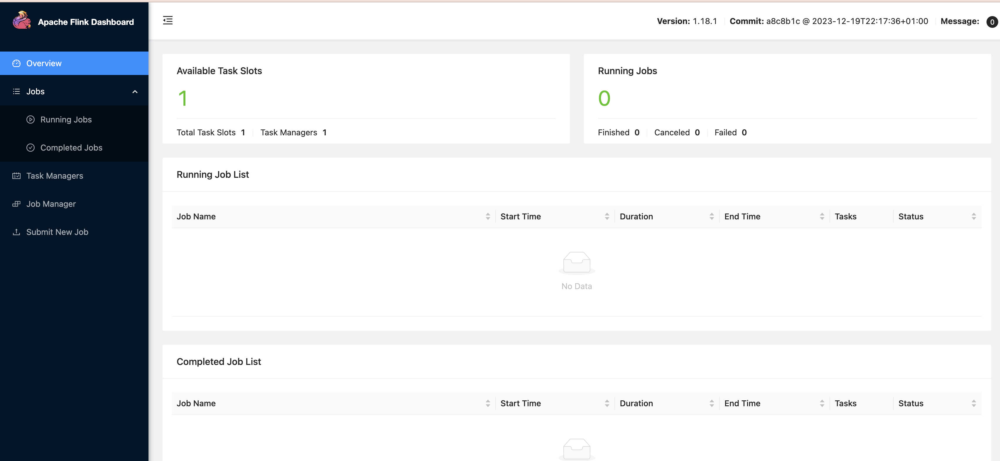
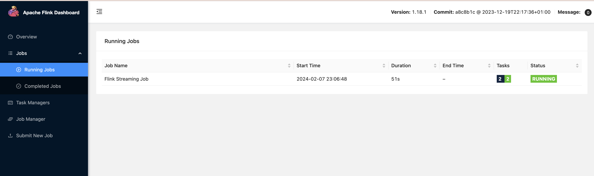
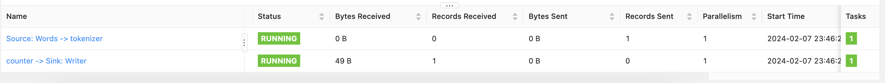

This tutorial shows how to get started with a simple "Wordcount" app that will use main Flink concepts - streaming map and reduce.
It uses Kotlin as development language and Gradle as build system.
## Setting up gradle project
Install *gradle* following instructions for your operating system.    
Then run `gradle init`.   

- Select type of project to generate: (2) application  
- Select implementation language: (4) kotlin
- Select build script DSL: (1) Kotlin   

This will create all the stubs for a Kotlin-based program, not yet related to apache flink in any way. Running `./gradlew run` will compile and execute the program, printing "Hello World" on the screen.   

Always use `./gradlew` command instead of `gradle`, apart from creating the project. This makes sure that you use the same version of Gradle that was used to build the project, not your local version of gradle that might differ.  

## Modyfying the build for Flink
When we will run our program on Flink cluster, we will pass in the final `.jar` file. Unlike our local machine that has kotlin and some other libraries that are properly linked at runtime, Flink cluster might not have that. So, we need to make sure all dependencies are packed in the same jar. Add this code to your `build.gradle.kts` file - main configuration file for Gradle project:  

```Kotlin
tasks.jar {
    isZip64 = true
    manifest.attributes["Main-Class"] = "WordCount"
    val dependencies = configurations
        .runtimeClasspath
        .get()
        .map(::zipTree)
    from(dependencies)
    duplicatesStrategy = DuplicatesStrategy.EXCLUDE
    exclude("META-INF/*")
    exclude("org/apache/flink/*")
    exclude("org/scala-lang/*")
}
```
This will override the default `jar` task of Gradle, adding necessary dependencies directly to the jar file. You can check your build by running `./gradlew jar`. This will put the compiled `.jar` file under `app/build/libs/app.jar`, though we can't run it yet because we reference WordCount class in the manifest, which doesn't exist yet.  

Then, add the following to `dependencies` section in `build.gradle.kts`:  
```Kotlin
implementation("org.jetbrains.kotlin:kotlin-stdlib:1.9.0")
```
This will make sure that the jar contains the kotlin stdlib as well.
## Writing Flink code
Next, replace the hello world content in the `App.kt` file (in my case, it was located under `app/src/main/kotlin/org/examples/App.kt`) with this:
```Kotlin
@file:JvmName("WordCount")

import org.apache.flink.api.common.eventtime.WatermarkStrategy
import org.apache.flink.api.common.functions.FlatMapFunction
import org.apache.flink.api.common.functions.ReduceFunction
import org.apache.flink.api.common.serialization.SimpleStringSchema
import org.apache.flink.api.connector.source.Source
import org.apache.flink.connector.kafka.source.KafkaSource
import org.apache.flink.connector.kafka.source.enumerator.initializer.OffsetsInitializer
import org.apache.flink.streaming.api.datastream.DataStream
import org.apache.flink.streaming.api.environment.StreamExecutionEnvironment
import org.apache.flink.streaming.api.functions.sink.PrintSink
import org.apache.flink.streaming.api.windowing.assigners.TumblingEventTimeWindows
import org.apache.flink.streaming.api.windowing.time.Time
import org.apache.flink.util.Collector

const val TOPIC = "input"

data class Event(var word: String, var count: Int) {
    constructor() : this("", 0)
}

fun main() {
    runJob()
}

fun runJob() {
    val source = KafkaSource.builder<String>()
        .setBootstrapServers("localhost:19092")
        .setTopics(TOPIC)
        .setStartingOffsets(OffsetsInitializer.earliest())
        .setValueOnlyDeserializer(SimpleStringSchema())
        .build()

    val env = StreamExecutionEnvironment.getExecutionEnvironment()
    defineWorkflow(env, source, 1) { workflow -> workflow.sinkTo(PrintSink()) }
    env.execute()
}

fun defineWorkflow(
    env: StreamExecutionEnvironment,
    source: Source<String, *, *>,
    sourceParallelism: Int,
    sinkApplier: (stream: DataStream<Event>) -> Unit
) {
    val textLines = env.fromSource(
        source,
        WatermarkStrategy.forMonotonousTimestamps(),
        "Words"
    ).setParallelism(sourceParallelism)

    val counts = textLines
        .flatMap(Tokenizer())
        .name("tokenizer")
        .keyBy { value -> value.word }
        .window(TumblingEventTimeWindows.of(Time.seconds(5)))
        .reduce(Sum())
        .name("counter")

    sinkApplier(counts)
}

class Tokenizer : FlatMapFunction<String, Event> {
    override fun flatMap(line: String, out: Collector<Event>) {
        line.lowercase()
            .split("\\W+".toRegex())
            .forEach { word ->
                out.collect(Event(word, 1))
            }
    }
}

class Sum : ReduceFunction<Event> {
    override fun reduce(value1: Event, value2: Event): Event {
        return Event(value1.word, value1.count + value2.count)
    }
}
```
We instruct our flink job to read input data from Kafka, located at `localhost:19092`, from the topic named `input`. As output, we simply print stuff to the log.   

The `defineWorkflow` defines the execution graph. We read input from kafka line by line; `flatMap` applies a map operation, applying a function to every element. In our case, it simply splits every line into words. We then do a combination of keyBy, window and reduce functions; this is analogous to "group by" + aggregation statement in SQL.   

`keyBy` groups all elements together; with sharded input and many processing nodes, different records can arrive at different shards for processing. `keyBy` makes sure that all records corresponding to a specific key are grouped on the same node for computation. Since input is "unbounded", we can never be sure that we have *all records*. So instead, we wait a certain time interval (here, 5 seconds), and then perform the computation.   

Actual reduce operation uses our `Sum` custom class. It is a template class, taking `Event` as template argument - the same one we defined in our tokenizer. This class acts as a binary reduce operator: it takes two terms, a and b, and computes their sum - a + b. This way, after applying same operation to a set of records, we reduce them all down to a single term.   

Add this to `build.gradle.kts`, in `dependencies` section:   
```Kotlin
implementation("org.apache.flink:flink-clients:1.18.0")
implementation("org.apache.flink:flink-connector-kafka:3.0.1-1.18")
```
This adds necessary dependencies so that our code is aware of Flink's headers (stuff like ReduceFunction and so on); and to Kafka flink connector. In general, various data sources and outputs (kafka, dynamodb, pubsub, gcs, ...) will have separate connectors.

## Installing flink
On ubuntu/mac:
```bash
wget "https://dlcdn.apache.org/flink/flink-1.18.1/flink-1.18.1-bin-scala_2.12.tgz"
tar -zxvf flink-1.18.1-bin-scala_2.12.tgz
```
After that, put the path to `flink-1.18.1/bin` folder to your PATH variable, then `flink` cmd utility will work.

From the same `bin` folder of flink, run the following command:   
```bash
./start-cluster.sh
```
This will start flink server, with UI being available on `localhost:8081`:   

    
## Running flink job
After building the tar and starting local flink cluster, you can run a job from the command line like this:
```bash
flink run app/build/libs/app.jar
```
```
Job has been submitted with JobID 73c72d6f6e99450fa6bd32c6ded9e7f5
```
The job should appear in Flink UI.   

    


The job itself will fail with the error similar to this:   
```
2024-02-07 23:07:49
org.apache.flink.runtime.JobException: Recovery is suppressed by NoRestartBackoffTimeStrategy
	at org.apache.flink.runtime.executiongraph.failover.flip1.ExecutionFailureHandler.handleFailure(ExecutionFailureHandler.java:176)
	at org.apache.flink.runtime.executiongraph.failover.flip1.ExecutionFailureHandler.getGlobalFailureHandlingResult(ExecutionFailureHandler.java:126)
	at org.apache.flink.runtime.scheduler.DefaultScheduler.handleGlobalFailure(DefaultScheduler.java:328)
	at org.apache.flink.runtime.operators.coordination.OperatorCoordinatorHolder$LazyInitializedCoordinatorContext.lambda$failJob$0(OperatorCoordinatorHolder.java:642)
	at org.apache.flink.runtime.rpc.pekko.PekkoRpcActor.lambda$handleRunAsync$4(PekkoRpcActor.java:451)
	at org.apache.flink.runtime.concurrent.ClassLoadingUtils.runWithContextClassLoader(ClassLoadingUtils.java:68)
	at org.apache.flink.runtime.rpc.pekko.PekkoRpcActor.handleRunAsync(PekkoRpcActor.java:451)
	at org.apache.flink.runtime.rpc.pekko.PekkoRpcActor.handleRpcMessage(PekkoRpcActor.java:218)
	at org.apache.flink.runtime.rpc.pekko.FencedPekkoRpcActor.handleRpcMessage(FencedPekkoRpcActor.java:85)
	at org.apache.flink.runtime.rpc.pekko.PekkoRpcActor.handleMessage(PekkoRpcActor.java:168)
	at org.apache.pekko.japi.pf.UnitCaseStatement.apply(CaseStatements.scala:33)
	at org.apache.pekko.japi.pf.UnitCaseStatement.apply(CaseStatements.scala:29)
	at scala.PartialFunction.applyOrElse(PartialFunction.scala:127)
	at scala.PartialFunction.applyOrElse$(PartialFunction.scala:126)
	at org.apache.pekko.japi.pf.UnitCaseStatement.applyOrElse(CaseStatements.scala:29)
	at scala.PartialFunction$OrElse.applyOrElse(PartialFunction.scala:175)
	at scala.PartialFunction$OrElse.applyOrElse(PartialFunction.scala:176)
	at scala.PartialFunction$OrElse.applyOrElse(PartialFunction.scala:176)
	at org.apache.pekko.actor.Actor.aroundReceive(Actor.scala:547)
	at org.apache.pekko.actor.Actor.aroundReceive$(Actor.scala:545)
	at org.apache.pekko.actor.AbstractActor.aroundReceive(AbstractActor.scala:229)
	at org.apache.pekko.actor.ActorCell.receiveMessage(ActorCell.scala:590)
	at org.apache.pekko.actor.ActorCell.invoke(ActorCell.scala:557)
	at org.apache.pekko.dispatch.Mailbox.processMailbox(Mailbox.scala:280)
	at org.apache.pekko.dispatch.Mailbox.run(Mailbox.scala:241)
	at org.apache.pekko.dispatch.Mailbox.exec(Mailbox.scala:253)
	at java.base/java.util.concurrent.ForkJoinTask.doExec(ForkJoinTask.java:290)
	at java.base/java.util.concurrent.ForkJoinPool$WorkQueue.topLevelExec(ForkJoinPool.java:1020)
	at java.base/java.util.concurrent.ForkJoinPool.scan(ForkJoinPool.java:1656)
	at java.base/java.util.concurrent.ForkJoinPool.runWorker(ForkJoinPool.java:1594)
	at java.base/java.util.concurrent.ForkJoinWorkerThread.run(ForkJoinWorkerThread.java:183)
Caused by: org.apache.flink.util.FlinkException: Global failure triggered by OperatorCoordinator for 'Source: Words -> tokenizer' (operator cbc357ccb763df2852fee8c4fc7d55f2).
	at org.apache.flink.runtime.operators.coordination.OperatorCoordinatorHolder$LazyInitializedCoordinatorContext.failJob(OperatorCoordinatorHolder.java:624)
	at org.apache.flink.runtime.operators.coordination.RecreateOnResetOperatorCoordinator$QuiesceableContext.failJob(RecreateOnResetOperatorCoordinator.java:248)
	at org.apache.flink.runtime.source.coordinator.SourceCoordinatorContext.failJob(SourceCoordinatorContext.java:395)
	at org.apache.flink.runtime.source.coordinator.SourceCoordinatorContext.handleUncaughtExceptionFromAsyncCall(SourceCoordinatorContext.java:408)
	at org.apache.flink.util.ThrowableCatchingRunnable.run(ThrowableCatchingRunnable.java:42)
	at java.base/java.util.concurrent.Executors$RunnableAdapter.call(Executors.java:515)
	at java.base/java.util.concurrent.FutureTask.run(FutureTask.java:264)
	at java.base/java.util.concurrent.ScheduledThreadPoolExecutor$ScheduledFutureTask.run(ScheduledThreadPoolExecutor.java:304)
	at java.base/java.util.concurrent.ThreadPoolExecutor.runWorker(ThreadPoolExecutor.java:1128)
	at java.base/java.util.concurrent.ThreadPoolExecutor$Worker.run(ThreadPoolExecutor.java:628)
	at java.base/java.lang.Thread.run(Thread.java:829)
Caused by: org.apache.flink.util.FlinkRuntimeException: Failed to list subscribed topic partitions due to 
	at org.apache.flink.connector.kafka.source.enumerator.KafkaSourceEnumerator.checkPartitionChanges(KafkaSourceEnumerator.java:234)
	at org.apache.flink.runtime.source.coordinator.ExecutorNotifier.lambda$null$1(ExecutorNotifier.java:83)
	at org.apache.flink.util.ThrowableCatchingRunnable.run(ThrowableCatchingRunnable.java:40)
	... 6 more
Caused by: java.lang.RuntimeException: Failed to get metadata for topics [input].
	at org.apache.flink.connector.kafka.source.enumerator.subscriber.KafkaSubscriberUtils.getTopicMetadata(KafkaSubscriberUtils.java:47)
	at org.apache.flink.connector.kafka.source.enumerator.subscriber.TopicListSubscriber.getSubscribedTopicPartitions(TopicListSubscriber.java:52)
	at org.apache.flink.connector.kafka.source.enumerator.KafkaSourceEnumerator.getSubscribedTopicPartitions(KafkaSourceEnumerator.java:219)
	at org.apache.flink.runtime.source.coordinator.ExecutorNotifier.lambda$notifyReadyAsync$2(ExecutorNotifier.java:80)
	... 6 more
Caused by: java.util.concurrent.ExecutionException: org.apache.kafka.common.errors.TimeoutException: Timed out waiting for a node assignment. Call: describeTopics
	at java.base/java.util.concurrent.CompletableFuture.reportGet(CompletableFuture.java:395)
	at java.base/java.util.concurrent.CompletableFuture.get(CompletableFuture.java:2005)
	at org.apache.kafka.common.internals.KafkaFutureImpl.get(KafkaFutureImpl.java:165)
	at org.apache.flink.connector.kafka.source.enumerator.subscriber.KafkaSubscriberUtils.getTopicMetadata(KafkaSubscriberUtils.java:44)
	... 9 more
Caused by: org.apache.kafka.common.errors.TimeoutException: Timed out waiting for a node assignment. Call: describeTopics
```
Most of this stuff is rubbish, which is typical for flink/java stacktraces. One of the necessary skills of Flink development is to be able to read through giant stack traces like this and find out important parts. In our case, the only important part is:   
```
Caused by: org.apache.flink.util.FlinkRuntimeException: Failed to list subscribed topic partitions due to 
	at org.apache.flink.connector.kafka.source.enumerator.KafkaSourceEnumerator.checkPartitionChanges(KafkaSourceEnumerator.java:234)
```
This is Kafka error - which makes sense, we told the job to expect kafka to be on localhost:19082, but it's not! At least we know how to launch jobs now.
## Setting up kafka
We will use [RedPanda](https://docs.redpanda.com/current/get-started/quick-start/) as our Kafka implementation. One of the ways to set that up is to use docker. Create the following `docker-compose.yml` file:  

```yml
version: "3.7"
name: redpanda-quickstart
networks:
  redpanda_network:
    driver: bridge
volumes:
  redpanda-0: null
services:
  redpanda-0:
    command:
      - redpanda
      - start
      - --kafka-addr internal://0.0.0.0:9092,external://0.0.0.0:19092
      # Address the broker advertises to clients that connect to the Kafka API.
      # Use the internal addresses to connect to the Redpanda brokers'
      # from inside the same Docker network.
      # Use the external addresses to connect to the Redpanda brokers'
      # from outside the Docker network.
      - --advertise-kafka-addr internal://redpanda-0:9092,external://localhost:19092
      - --pandaproxy-addr internal://0.0.0.0:8082,external://0.0.0.0:18082
      # Address the broker advertises to clients that connect to the HTTP Proxy.
      - --advertise-pandaproxy-addr internal://redpanda-0:8082,external://localhost:18082
      - --schema-registry-addr internal://0.0.0.0:8081,external://0.0.0.0:18081
      # Redpanda brokers use the RPC API to communicate with each other internally.
      - --rpc-addr redpanda-0:33145
      - --advertise-rpc-addr redpanda-0:33145
      # Tells Seastar (the framework Redpanda uses under the hood) to use 1 core on the system.
      - --smp 1
      # The amount of memory to make available to Redpanda.
      - --memory 1G
      # Mode dev-container uses well-known configuration properties for development in containers.
      - --mode dev-container
      # enable logs for debugging.
      - --default-log-level=debug
    image: docker.redpanda.com/redpandadata/redpanda:v23.3.4
    container_name: redpanda-0
    volumes:
      - redpanda-0:/var/lib/redpanda/data
    networks:
      - redpanda_network
    ports:
      - 18081:18081
      - 18082:18082
      - 19092:19092
      - 19644:9644
  console:
    container_name: redpanda-console
    image: docker.redpanda.com/redpandadata/console:v2.4.2
    networks:
      - redpanda_network
    entrypoint: /bin/sh
    command: -c 'echo "$$CONSOLE_CONFIG_FILE" > /tmp/config.yml; /app/console'
    environment:
      CONFIG_FILEPATH: /tmp/config.yml
      CONSOLE_CONFIG_FILE: |
        kafka:
          brokers: ["redpanda-0:9092"]
          schemaRegistry:
            enabled: true
            urls: ["http://redpanda-0:8081"]
        redpanda:
          adminApi:
            enabled: true
            urls: ["http://redpanda-0:9644"]
    ports:
      - 8080:8080
    depends_on:
      - redpanda-0
```
Then run `docker compose up`. If all is well, the containers will start, and kafka will be available under `localhost:19092` address.   

To check that, install local version of `rpk`: [link](https://docs.redpanda.com/current/get-started/rpk-install/). Then run:  
```bash
rpk -X brokers=localhost:19092 topic list
```
```
NAME      PARTITIONS  REPLICAS
_schemas  1           1
```
Now, create the actual topic:   
```bash
rpk -X brokers=localhost:19092 topic create input
```
And check again that the topic was created:   
```bash
rpk -X brokers=localhost:19092 topic list
```
```
NAME      PARTITIONS  REPLICAS
_schemas  1           1
input     1           1
```
Run the job again to see how it works:  
```bash
flink run app/build/libs/app.jar
```
Wait a minute to make sure that no exceptions occur. In normal mode, the job will keep on running forever until it's cancelled. However, since noone writes to our local kafka topic, nothing is really happening. Let's publish some messages to fix that:  
```bash
rpk -X brokers=localhost:19092 topic produce input
```
This will prompt you to type something in. Better put in several lines at once, because our only output sink prints to logs, and they might not flush after just one line.   

This is how your job's stats might look like:   

    

Note non-zero records sent by the tokenizer, and non-zero records received by our print sink.

To read the actual log with the output, go to Job Manager Log -> Log List -> one of "taskexecutor" logs. It should have around 100 bytes size:  
```
Event(word=hello, count=1)
Event(word=there, count=1)
Event(word=harry, count=1)
Event(word=you, count=1)
Event(word=i, count=1)
Event(word=hello, count=1)
Event(word=was, count=1)
Event(word=expecting, count=1)
Event(word=makmakmak, count=1)
Event(word=hello, count=2)
Event(word=hello, count=1)
Event(word=hello, count=1)
Event(word=flush, count=3)
```
This is it for today! Simple local flink setup works.