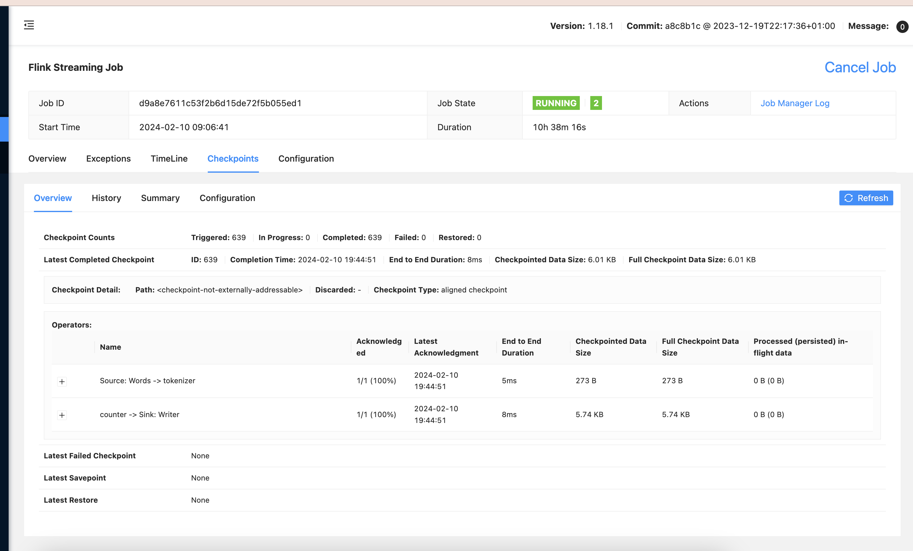

In previous tutorials, we want through simple flink job setup, and then learned how to push data to DynamoDB as a sink. In this tutorial, let's discuss how to aggregate word counts properly: so that they persist from window to window. The job will output total wordcount to DynamoDB, aggregated over entire job runtime - months or years, potentially! In addition, we'll discuss things that we skipped in previous tutorials: watermarks and windows. Here is entire plan for today:
- Stateful streaming processing to make our counters aggregate without resetting
- Checkpoints
- Watermarks
- Windows
## Stateful streaming processing
Our previous examples were "stateless": some data comes in, the job reacts to that data, does some processing, and spews out the output. With windows, that allows us to compute word counts over 5-second interval, for example. But not to aggregate a counter over entire job lifetime.   

To do lifetime aggregation, we need state. Luckily, Flink provides all the functionality to make working with state easy: it allows checkpointing to save state; it knows how to move state from node to node, how to reshuffle it if we change the number of workers, and so on.   

To start using state, we add custom processing function to our pipeline:  
```Kotlin
    val counts = textLines
        .flatMap(Tokenizer())
        .name("tokenizer")
        .keyBy { value -> value.word }
        .window(TumblingEventTimeWindows.of(Time.seconds(5)))
        .reduce(Sum(), ProcessEvents())
        .name("counter")
```

And write the code for this processing func:   
```Kotlin
class ProcessEvents :
    ProcessWindowFunction<Event, Event, String, TimeWindow>() {
    
    private lateinit var stateDescriptor: ValueStateDescriptor<Event>

    override fun open(parameters: Configuration) {
        stateDescriptor = ValueStateDescriptor("Event", Event::class.java)
        super.open(parameters)
    }

    override fun process(
        word: String,
        context: Context,
        events: Iterable<Event>,
        collector: Collector<Event>
    ) {
        val state: ValueState<Event> = context.globalState().getState(stateDescriptor)

        var accumulatedEvent = state.value() ?: Event(word, 0)
        for (event in events) {
            accumulatedEvent.count += event.count
        }

        state.update(accumulatedEvent)
        accumulatedEvent.let { collector.collect(it) }
    }
}
```
The processing function has the following template arguments: `<Event, Event, String, TimeWindow>`. It takes Event as an input and output, it operates on a keyed stream with keys of type String and window of type TimeWindow.   

We define a state descriptor of type `ValueStateDescriptor`. This means that we will store actual values of type Event in state. Other options are lists of values, maps and so on. There will always be a "key" associated with the state though, you might need maps only if you need advanced nestedness.   

Main logic resides in the `process` function. This is a more low-level function than Sum aggregation. Instead of defining an operator that will then be applied by Flink, we define an entire function that receive iterator over input and output collector. This gives us more flexibility about what we can do.   

We get the state from our context using state descriptor. `globalState` means we refer to our lifetime state. Alternative is to use `windowState` that only refers to state within current window and does not persist between windows.   

Input state can be missing, in case we encounter this word for the first time. That's why the value has type `Event?`, and we use Event with count of zero if the state is missing.   

We iterate over all the inputs, though we already applied `Sum()` function to the keyed stream, so we'll only get one iteration.  

Finally, we write our updated Event with counts both to the state and to the output. This makes sure that whatever we write into dynamodb and state will have the same total lifetime count.
## Checkpointing
What will happen if the worker fails? That can be due to machine going down or some transient exception occuring. If the job really does run for a few months and has some accumulated state, it will be real shame to lose all of that.   

To prevent loss, Flink has a well-built checkpointing mechanism. It is disabled by default, but can be enabled like this:  
```Kotlin
val env = StreamExecutionEnvironment.getExecutionEnvironment()
// checkpoint every minute
env.enableCheckpointing(60000);
```
You can check that checkpoints are being saved succesfully in the "checkpoints" tab of the job in Flink UI:  

    

By default, checkpoints are saved on disk on the Flink cluster. It usually makes more sense to configure it to be stored in external persistent storage - s3 or gcs.

## Window aggregation
Windowing is needed to perform reduce operations. In batch MapReduce, if we want "group by" or aggregations, we always wait until all previous stages (like map+filter) are complete, so that reducer code gets ALL input events. This only works for bounded collections; with unbounded collections, like Kafka topics, we can never get ALL events. Instead, we can divide ongoing time into "windows", and only wait for the window to finish before starting the reduce stage.   

"Tumbling Window" divides time into unintersecting intervals. For example, tumbling window with 5 minutes duration can go like this: 13:00 to 13:05, 13:05 to 13:10, 13:10 to 13:15 and so on. Alternatively, there is "Sliding Window"; sliding window with 1 hour duration and 5 minutes stride that can go 13:00 to 14:00, 13:05 to 14:05, 13:10 to 14:10 and so on.   

Any window might drastically reduce the number of events being passed through. For example, if you collect data from the application like "likes" and "clicks", the number of events published might reach thousands a second. If you have 1-second window, and you are just interested in aggregate counts rather then specific events, you will reduce the number of events passed through to just 1 per second. In this case, windowing allows you to "batch" processing, easing off load on your sinks - databases, other kafka topics and so on.   

Larger window durations further decrease number of output events; downside of that is increased memory consumption and increased delays. If your window size is 5 minutes, there will be *at least* 5 minutes from an event happening and event making it through your streaming processing system.   

Window aggregation also allow you to do more complex stream data aggregations. For example, if you are looking at posts that were viewed but not liked within 5 minutes of the view, you might do that with windowed aggregation.
## Watermarks
Watermarks, that we've had in our code from tutorial #1, is a mechanism to combat out of order events. In our current case, we publish events to kafka, and use kafka ingestion timestamp as time; in this case, it is guaranteed to be monotonous. What if we want to use time when the event happened, for example? Then we lose that guarantee.   

If we had event timestamps coming like this: 13:00, 13:01, 13:02, 12:59, 13:03, 13:00, 13:05. Some events came a bit late. The option we used, `WatermarkStrategy.forMonotonousTimestamps()`, will simply ignore all events with timestamps smaller then current maximum that was seen. In the case described, that's 2 out of 7 events, or around 28% event loss!   

Alternative watermark strategies allow trade-offs between overall pipeline latency and event loss in cases when late events are common. One such strategy is "BoundedOutOfOrderness". Under this trategy, the stream will wait a fixed interval - say, 5 minutes - for late events. This means that upon receiving an event with timestamp 13:05, the stream will publish just the "13:00" watermark, triggering potential window closes downstream for windows ending at 13:00. This means that effective latency of the pipeline increases by 5 minutes, but it might prevent event loss.